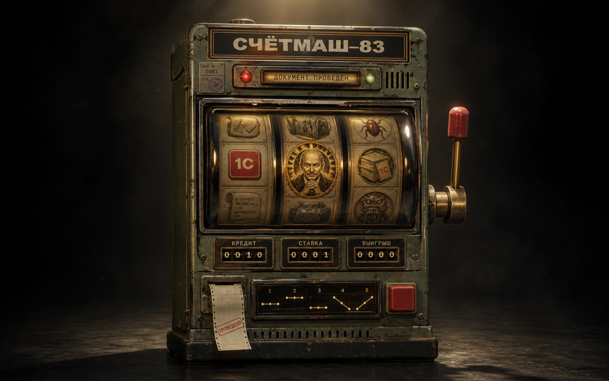
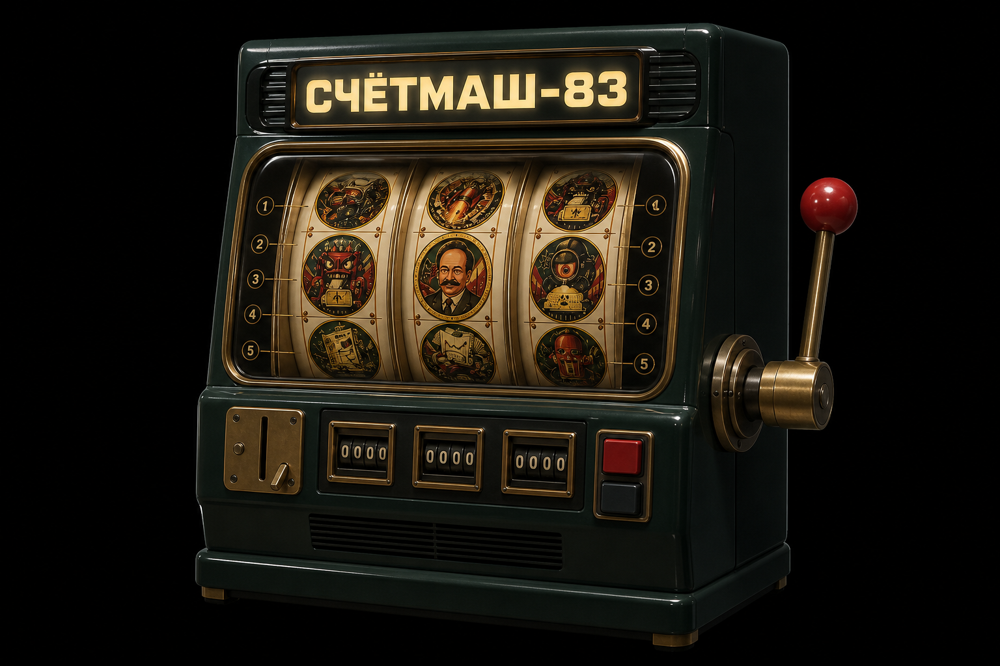
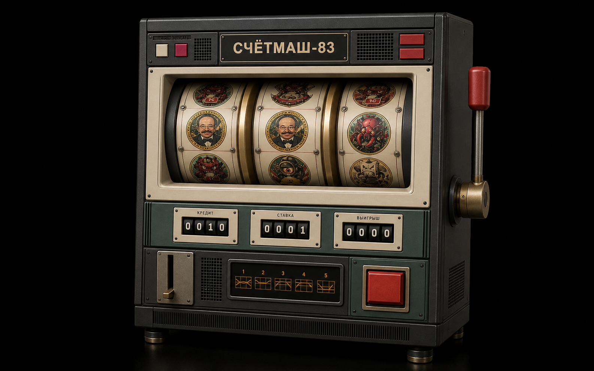
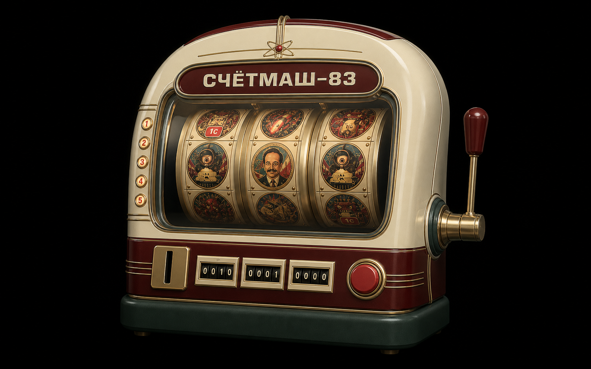

# Выбор корпуса СЧЁТМАШ-83

Статус: гибрид A+B реализован в 0.3.0; в 0.4.0 утверждён и перенесён в 3D
характер **«Бюрократический оракул»**.

## D — «Бюрократический оракул» (текущее направление)

Это не новый силуэт, а character pass поверх A+B: служебное табло становится
«лицом», сигнальные лампы — выражением, монетник — ритуалом допуска, а бумажный
чек физически подтверждает или отклоняет расчёт. В игровую модель перенесено
около 75% износа концепта, чтобы сохранить ощущение работающего прибора, а не
постапокалиптического реквизита.

Во всех трёх вариантах сохранены обязательные решения: настоящие цилиндрические
барабаны, одно общее глубокое стекло, отдельный рычаг, пять встроенных линий и
Нуралиев как главный золотой символ.

## A — «КБ-83» (рекомендуемый)

Монолитная тёмно-зелёная эмаль, минимум латунного декора, максимально сильный
центр барабанов. Лучше всего продолжает исходную идею и решает проблему
визуального шума.

## B — «ЕС ЭВМ-Казино»

Строгий вычислительный прибор конца 1970-х: модульные панели, графитовый корпус,
отдельный дисплей схем линий. Самый «1С-инженерный» и функциональный вариант.

## C — «Атомная касса»

Округлый выставочный прибор 1950–1960-х: слоновая кость, бордовая эмаль и
панорамное стекло. Самый дружелюбный и выразительный, но дальше всего от текущей
геометрии и потому дороже в реализации.

## Сравнение

| Критерий | A | B | C |
|---|---:|---:|---:|
| Цельность силуэта | 5 | 4 | 5 |
| Связь с текущим прототипом | 5 | 4 | 3 |
| Инженерная тема 1С | 4 | 5 | 3 |
| Чистота интерфейса | 5 | 4 | 5 |
| Стоимость переделки | низкая | средняя | высокая |

Итоговое решение: **A** задаёт монолитную тёмно-зелёную форму и панорамное окно,
из **B** взят дисплей пяти линий, а **D** отвечает за характер, служебный износ и
реакции. Отдельный рычаг сохранён за пределами корпуса; Нуралиев выделен золотой
суперсценой и репликой «ДИРЕКТОР ОДОБРИЛ».
