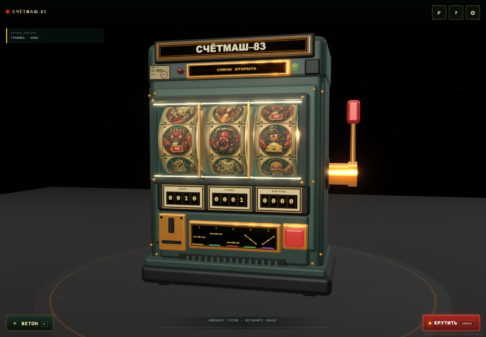
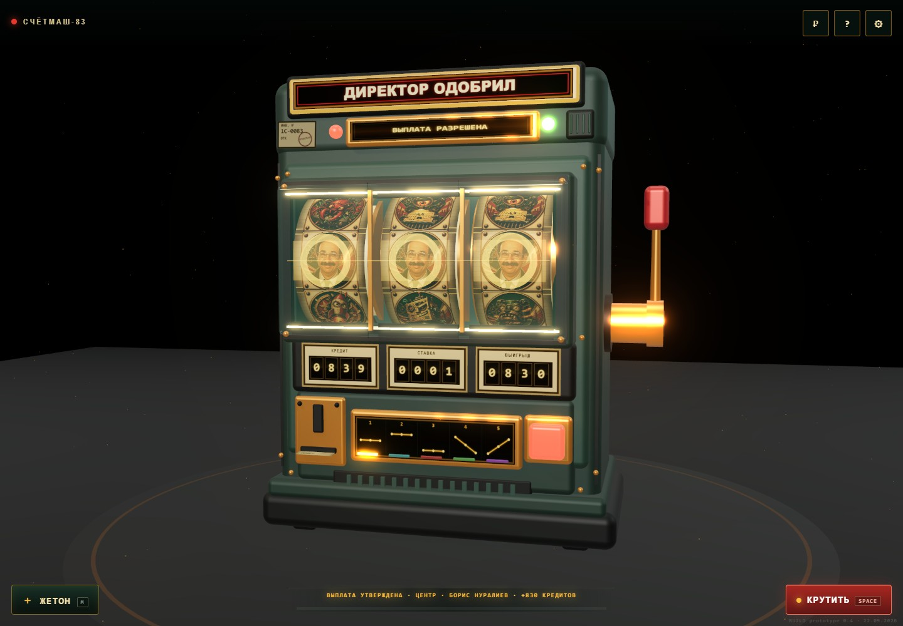
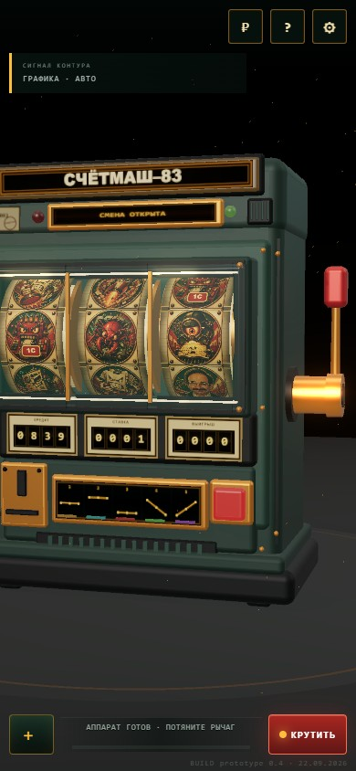

# СЧЁТМАШ-83

Браузерный 3D-автомат в эстетике советского ретрофутуризма и с юмором из мира 1С. Три механических барабана, тяжёлый красный рычаг, жетоны и аппарат, который любую удачу сначала проводит по регистрам.

🎮 **[Играть онлайн](https://andromanpro.github.io/schetmash-83/)** · [Скачать готовую сборку](https://github.com/andromanpro/schetmash-83/releases/latest)



> **Бюрократический оракул.** Бросаешь жетон, тянешь рычаг — аппарат сверяет регистры, выносит решение и печатает длинный чек. Даже джекпот должен получить резолюцию «ДИРЕКТОР ОДОБРИЛ».



Это игра с виртуальными кредитами: их можно добавлять клавишей **M**. Покупки кредитов, денежных ставок и вывода выигрышей нет.

## Как играть

1. Нажми кнопку старта, Enter или пробел.
2. Добавь жетон клавишей **M**, если кредиты закончились.
3. Потяни красный рычаг мышью, нажми кнопку на корпусе или **пробел**.
4. Следи за пятью линиями выигрыша и читай решение аппарата на чеке.

| Управление | Действие |
|---|---|
| Enter / пробел | Начать игру или вращение |
| M | Добавить жетон |
| Красный рычаг или кнопка | Вращать барабаны |
| Мышь и колесо | Осмотреть автомат |
| P | Таблица выплат |
| Esc | Закрыть панель |
| Кнопка настроек | Звук, бесплатная игра, графика и счётчик FPS |

## Что внутри

- **Объёмный аппарат.** Корпус, механизмы, барабаны, рычаг и монетоприёмник собраны в Three.js. Жетон летит по видимой дуге до прорези.
- **Пять линий.** Три горизонтали и две диагонали; выигрыши суммируются. «Ядро данных» заменяет другие символы, три Нуралиева дают ×830.
- **Свой характер.** Служебное табло, лампы, звуки реле, печать решения и бумага, которая выходит из принтера, изгибается и сворачивается у основания.
- **Иллюстрации из мира 1С.** Документ, регистр, запрос, модуль, релиз, ошибка и сатирический образ директора.
- **Графические режимы.** Автоматический, экономный и кинематографический; настройки звука, bloom и FPS. Есть мобильный интерфейс.
- **Сохранение.** Настройки и игровая статистика остаются в `localStorage` браузера.
- **Без внешних сервисов в игре.** Ресурсы загружаются с того же сайта, звуки синтезируются через WebAudio.

<details>
<summary>Мобильный вид</summary>



</details>

## Локальный запуск

Нужен **Node.js 24 LTS** и современный браузер с WebGL 2. Совместимый минимум Node.js — 22.12.

```bash
npm ci
npm run dev
```

Открой [localhost:5274](http://localhost:5274/). Через двойной клик по исходному HTML игра не запускается: нужен сервер.

```bash
npm run build     # готовые файлы в dist/
npm run preview   # просмотр сборки на localhost:4274
```

Содержимое `dist/` можно разместить на статическом хостинге, в том числе в подкаталоге. Архив готовой сборки доступен в [Releases](https://github.com/andromanpro/schetmash-83/releases).

## Проверки и разработка

```bash
npm test                  # математика, бумажный чек, браузерные сценарии
npm run build             # сборка и проверка production
npm audit                 # известные уязвимости зависимостей
npm run shot              # контрольные скриншоты в shots/
node tools/promo-shots.mjs # скриншоты для README
```

Браузерные проверки используют установленный Chrome, Chromium или Edge. Если браузер не найден автоматически, задай переменную окружения `CHROME_PATH` с путём к исполняемому файлу. Сервер для тестов запускается автоматически; порт 5274 должен быть свободен.

В GitHub Actions выполняются тесты, сборка и аудит зависимостей. После успешной проверки `main` сборка публикуется на GitHub Pages.

Основные модули: `src/main.js` — состояние и управление, `src/game-math.js` — барабаны и выплаты, `src/machine.js` — аппарат, `src/receipt-paper.js` — бумага, `src/symbols.js` — символы, `src/audio.js` — звук. Концепты корпуса описаны в [DESIGN.md](DESIGN.md).

Принудительный результат `window.__slot.force(...)` доступен только в режиме разработки; production-проверка следит, чтобы он не попал в опубликованную игру.

## Лицензия

[MIT](LICENSE). Происхождение графики и уведомления о сторонних компонентах — в [ASSETS.md](ASSETS.md).

Неофициальный сатирический проект, не связанный с фирмой «1С». Обозначения и образы используются как художественные отсылки и не означают одобрения со стороны упомянутых лиц и организаций.

## Автор

Сделал **[Androman](https://androman.pro)**.

🌐 [androman.pro](https://androman.pro) · ✈ [Telegram](https://t.me/andromanpro1c) · [GitHub @andromanpro](https://github.com/andromanpro)
