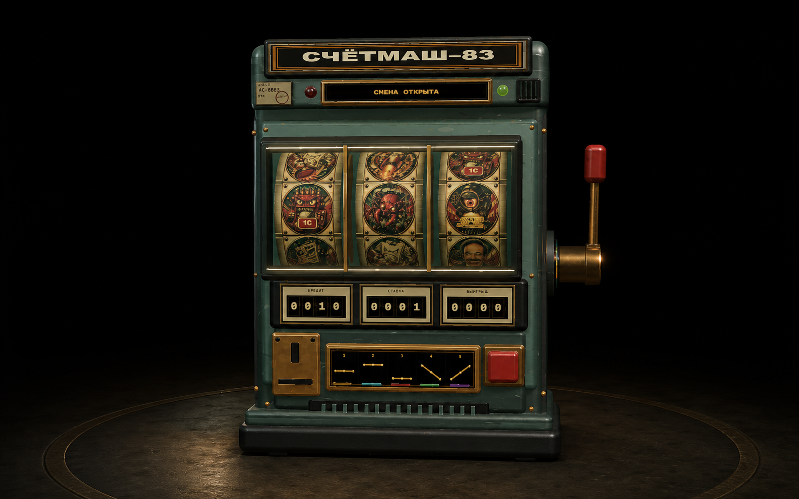
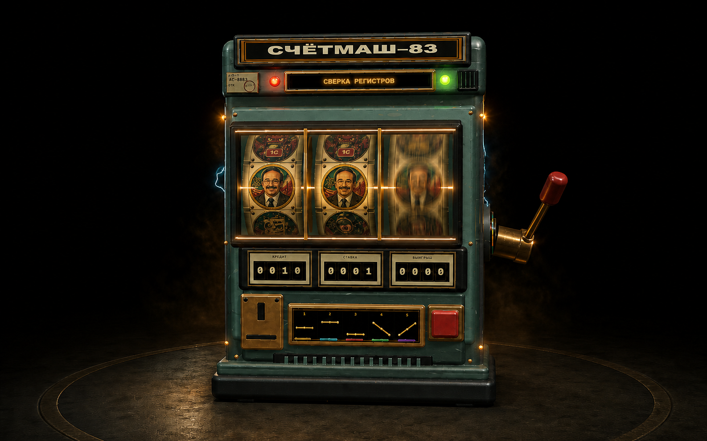
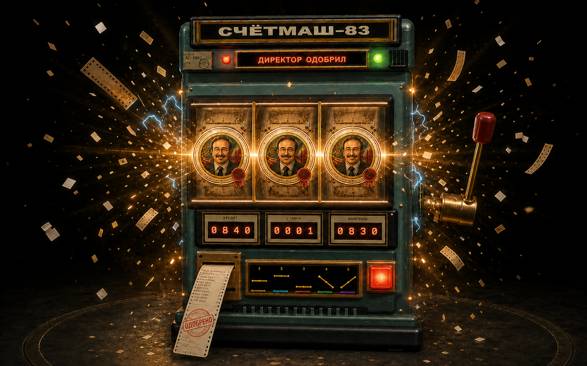

# Ключевые кадры v1

Три кадра фиксируют режиссуру состояний до переноса решений в Three.js.

## 1. Спокойный автомат

- почти фронтальная камера;
- корпус и рычаг видны целиком;
- рычаг отделён тёмным воздушным зазором;
- приглушённые зелёный, кремовый и латунь;
- без стен, крупного экранного заголовка и казино-подсветки.

## 2. Вращение / предвыигрыш

- два Нуралиева уже стоят на центральной линии;
- третий цилиндр замедляется, портрет только подходит к линии;
- рычаг находится под нагрузкой;
- свет и электрические акценты усиливаются, но празднование ещё не началось.

## 3. Суперджекпот Нуралиева

- Нуралиев получает уникальные медальоны и директорские печати;
- выигрыш показывается самим корпусом, без плавающего веб-баннера;
- кредит `0840`, ставка `0001`, выигрыш `0830`;
- частицы — перфокарты, бумажные полосы и электрические искры вместо обычного конфетти;
- квитанция с печатью «ОДОБРЕНО» завершает сцену.

Статус: предложение для согласования, не финальные игровые ассеты.
